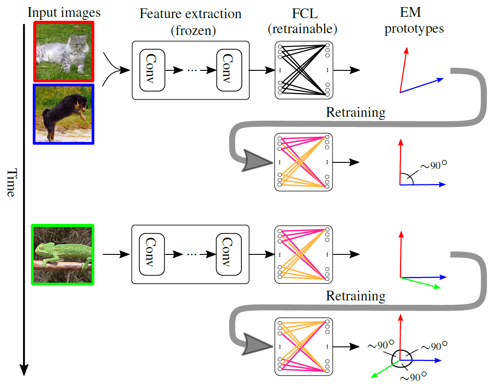

# Constrained Few-shot Class-incremental Learning

### Michael Hersche, Geethan Karunaratne, Giovanni Cherubini, Luca Benini, Abu Sebastian, Abbas Rahimi

_CVPR'22_

<div align="center">
  
</div>

## Requirements

The `conda` software is required for running the code. Generate a new environment with

```
$ conda create --name cfscil_env python=3.6
$ conda activate cfscil_env
```

We need PyTorch 1.3 and CUDA. 

```
$ (cfscil_env) conda install pytorch=1.3 torchvision cudatoolkit=10.1 -c pytorch
$ (cfscil_env) pip install -r requirements.txt
```
## Datasets

We provide the code for running experiments on miniImageNet and CIFAR100. The experiments for Omniglot have been conducted in a different framework, and cannot be released. However, we provide our split under `data/index_list/omniglot` as well as a dataloader under `code/lib/dataloader/FSCIL/omniglot`. 

We follow the [FSCIL](https://github.com/xyutao/fscil) setting to use the same data index_list for training. For CIFAR100, the dataset will be download automatically. For miniImageNet, you can download the dataset [here](https://drive.google.com/drive/folders/11LxZCQj2FRCs0JTsf_dafvTHqFn2yGSN?usp=sharing). Please put the downloaded file under `code/data/` folder and unzip it. 
```    
$ (cfscil_env) cd code/data/
$ (cfscil_env) gdown 1_x4o0iFetEv-T3PeIxdSbBPUG4hFfT8U
$ (cfscil_env) tar -xvf miniimagenet.tar 
```
## Usage

The whole simulator is runnable from the command line via the `code/main.py` script which serves as a command parser. Everything should be run from the `code` directory. 

The structure of any command looks like
```
$ (cfscil_env) python main.py command [subcommand(s)] [-option(s)] [argument(s)]
```
and help can be found for every `command` and `subcommand` by adding a trailing `--help`. The `main.py` file also contains all default parameters used for simulations.

### Simulation

To run a single simulation of the model (incl. training, validation, testing), use the `simulation` command. A logging directory should be specified, in case the default path is not wanted. Any simulation parameter that should be different from the default found in `main.py` can be specified by chaining `-p parameter value` pairs.
```bash
$ (cfscil_env) python main.py simulation --logdir path/to/logdir -p parameter_1 value_1 -p parameter_2 value_2
```
All parameters are interpreted as strings and translated by the parser, so no `"`s are needed. Boolean parameters' value can be specified as `t`, `true`, `f` or `false`.


Run main experiments on CIFAR100
```bash
# Pretraining
$ (cfscil_env) python -u main.py simulation -v -ld "log/test_CIFAR100/pretrain_basetrain" -p max_train_iter 120  -p data_folder "data" -p trainstage pretrain_baseFSCIL -p pretrainFC linear -p dataset cifar100 -p random_seed 7 -p learning_rate 0.01 -p batch_size 128 -p optimizer SGD -p SGDnesterov True -p lr_step_size 30 -p representation real -p dim_features 512 -p block_architecture mini_resnet12

# Metatraining
$ (cfscil_env) python -u main.py simulation -v -ld "log/test_CIFAR100/meta_basetrain" -p max_train_iter 70000 -p data_folder "data" -p resume "log/test_CIFAR100/pretrain_basetrain"  -p trainstage metatrain_baseFSCIL -p dataset cifar100 -p average_support_vector_inference True -p random_seed 7 -p learning_rate 0.01 -p batch_size_training 10 -p batch_size_inference 128 -p optimizer SGD -p sharpening_activation softabs -p SGDnesterov True -p lr_step_size 30000  -p  representation tanh -p dim_features 512 -p num_ways 60 -p num_shots 5 -p block_architecture mini_resnet12

# Evaluation Mode 1 (num_shots relates only to number of shots in base session, on novel there are always 5)
$ (cfscil_env) python -u main.py simulation -v -ld "log/test_CIFAR100/eval/mode1"  -p data_folder "data"  -p resume "log/test_CIFAR100/meta_basetrain" -p dim_features 512 -p retrain_iter 0 -p nudging_iter 0 -p bipolarize_prototypes False -p nudging_act_exp 4 -p nudging_act doubleexp -p trainstage train_FSCIL -p dataset cifar100 -p random_seed 7 -p learning_rate 0.01 -p batch_size_training 128 -p batch_size_inference 128 -p num_query_training 0 -p optimizer SGD -p sharpening_activation abs -p SGDnesterov True -p representation tanh -p retrain_act tanh -p num_ways 60 -p num_shots 200 -p block_architecture mini_resnet12

# Evaluation Mode 2
$ (cfscil_env) python -u main.py simulation -v -ld "log/test_CIFAR100/eval/mode2"  -p data_folder "data"  -p resume "log/test_CIFAR100/meta_basetrain" -p dim_features 512 -p retrain_iter 10 -p nudging_iter 0 -p bipolarize_prototypes True -p nudging_act_exp 4 -p nudging_act doubleexp -p trainstage train_FSCIL -p dataset cifar100 -p random_seed 7 -p learning_rate 0.01 -p batch_size_training 128 -p batch_size_inference 128 -p num_query_training 0 -p optimizer SGD -p sharpening_activation abs -p SGDnesterov True -p representation tanh -p retrain_act tanh -p num_ways 60 -p num_shots 200 -p block_architecture mini_resnet12

# Evaluation Mode 3
$ (cfscil_env) python -u main.py simulation -v -ld "log/test_CIFAR100/eval/mode3" -p data_folder "data"  -p resume "log/test_CIFAR100/meta_basetrain" -p dim_features 512 -p retrain_iter 50 -p nudging_iter 100 -p bipolarize_prototypes False -p nudging_act_exp 4 -p nudging_act doubleexp -p trainstage train_FSCIL -p dataset cifar100 -p random_seed 7 -p learning_rate 0.01 -p batch_size_training 128 -p batch_size_inference 128 -p num_query_training 0 -p optimizer SGD -p sharpening_activation abs -p SGDnesterov True -p representation tanh -p retrain_act tanh -p num_ways 60 -p num_shots 200 -p block_architecture mini_resnet12
```


Run main experiments on miniImageNet
```bash
# Pretraining
$ (cfscil_env) python -u main.py simulation -v -ld "log/test_mini_imagenet/pretrain_basetrain" -p max_train_iter 120  -p data_folder "data" -p trainstage pretrain_baseFSCIL -p pretrainFC linear -p dataset mini_imagenet -p random_seed 7 -p learning_rate 0.01 -p batch_size 128 -p optimizer SGD -p SGDnesterov True -p lr_step_size 30 -p representation real -p dim_features 512 -p block_architecture mini_resnet12

# Metatraining
$ (cfscil_env) python -u main.py simulation -v -ld "log/test_mini_imagenet/meta_basetrain" -p max_train_iter 70000 -p data_folder "data" -p resume "log/test_mini_imagenet/pretrain_basetrain"  -p trainstage metatrain_baseFSCIL -p dataset mini_imagenet -p average_support_vector_inference True -p random_seed 7 -p learning_rate 0.01 -p batch_size_training 10 -p batch_size_inference 128 -p optimizer SGD -p sharpening_activation softabs -p SGDnesterov True -p lr_step_size 30000  -p  representation tanh -p dim_features 512 -p num_ways 60 -p num_shots 5 -p block_architecture mini_resnet12

# Evaluation Mode 1 (num_shots relates only to number of shots in base session, on novel there are always 5)
$ (cfscil_env) python -u main.py simulation -v -ld "log/test_mini_imagenet/eval/mode1"  -p data_folder "data"  -p resume "log/test_mini_imagenet/meta_basetrain" -p dim_features 512 -p retrain_iter 0 -p nudging_iter 0 -p bipolarize_prototypes False -p nudging_act_exp 4 -p nudging_act doubleexp -p trainstage train_FSCIL -p dataset mini_imagenet -p random_seed 7 -p learning_rate 0.01 -p batch_size_training 128 -p batch_size_inference 128 -p num_query_training 0 -p optimizer SGD -p sharpening_activation abs -p SGDnesterov True -p representation tanh -p retrain_act tanh -p num_ways 60 -p num_shots 100 -p block_architecture mini_resnet12

# Evaluation Mode 2
$ (cfscil_env) python -u main.py simulation -v -ld "log/test_mini_imagenet/eval/mode2"  -p data_folder "data"  -p resume "log/test_mini_imagenet/meta_basetrain" -p dim_features 512 -p retrain_iter 10 -p nudging_iter 0 -p bipolarize_prototypes True -p nudging_act_exp 4 -p nudging_act doubleexp -p trainstage train_FSCIL -p dataset mini_imagenet -p random_seed 7 -p learning_rate 0.01 -p batch_size_training 128 -p batch_size_inference 128 -p num_query_training 0 -p optimizer SGD -p sharpening_activation abs -p SGDnesterov True -p representation tanh -p retrain_act tanh -p num_ways 60 -p num_shots 100 -p block_architecture mini_resnet12

# Evaluation Mode 3
$ (cfscil_env) python -u main.py simulation -v -ld "log/test_mini_imagenet/eval/mode3" -p data_folder "data"  -p resume "log/test_mini_imagenet/meta_basetrain" -p dim_features 512 -p retrain_iter 50 -p nudging_iter 100 -p bipolarize_prototypes False -p nudging_act_exp 4 -p nudging_act doubleexp -p trainstage train_FSCIL -p dataset mini_imagenet -p random_seed 7 -p learning_rate 0.01 -p batch_size_training 128 -p batch_size_inference 128 -p num_query_training 0 -p optimizer SGD -p sharpening_activation abs -p SGDnesterov True -p representation tanh -p retrain_act tanh -p num_ways 60 -p num_shots 100 -p block_architecture mini_resnet12
```


### Inspection with TensorBoard

For a detailed inspection of the simulation, the TensorBoard tool can be used. During simulations, data is collected which can be illustrated by the tool in the browser. 

## Acknowledgment

Our code is based on 
- [FSCIL](https://github.com/xyutao/fscil) (Dataset)
- [CEC](https://github.com/icoz69/CEC-CVPR2021) (Dataloader)
- [DeepEMD](https://github.com/icoz69/DeepEMD) (ResNet12)

## Citation

If you use the work released here for your research, please cite this paper:
```
@inproceedings{hersche2022cfscil,
    Author = {Hersche, Michael and Karunaratne, Geethan and Cherubini, Giovanni and Benini, Luca and Sebastian, Abu and Rahimi, Abbas },
    Booktitle = {Proceedings of the IEEE Conference on Computer Vision and Pattern Recognition (CVPR)},
    Title = {Constrained Few-shot Class-incremental Learning},
    Year = {2022}}
```

## License
Our code is licensed under Apache 2.0. Please refer to the LICENSE file for the licensing of our code. 
